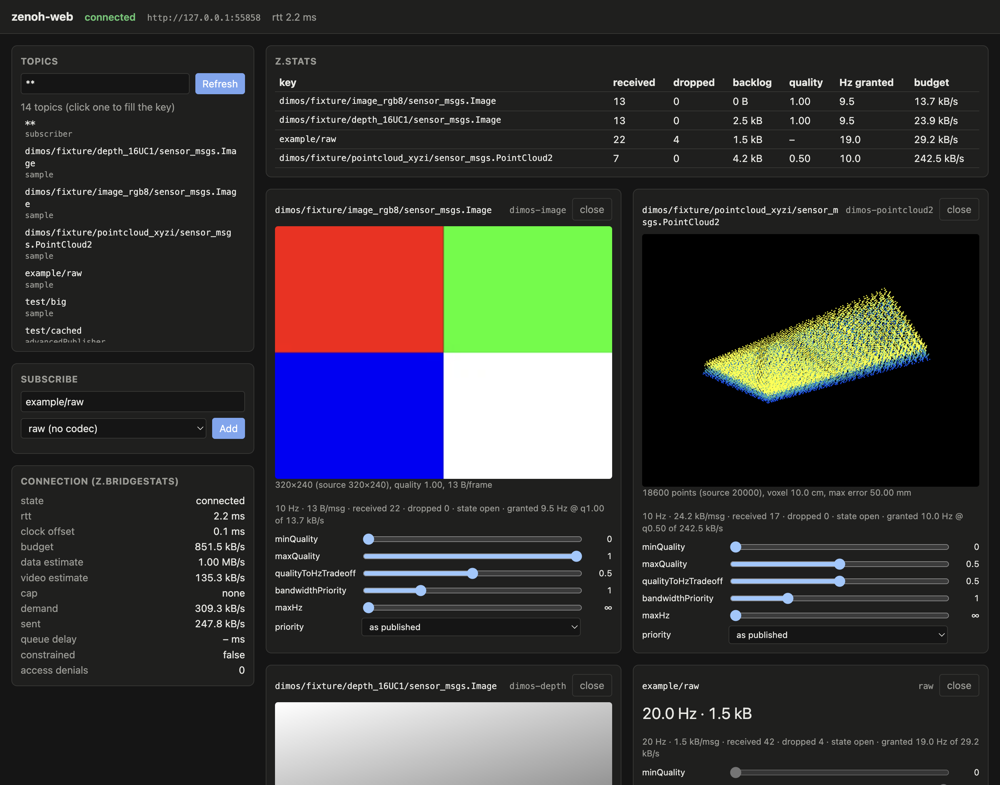

# zenoh-web

View and drive a [zenoh](https://zenoh.io) system from a browser over a squeezed network (a phone on
weak wifi), without a heavy bridge: one small Rust process, WebRTC to the browser, and a dependency-free
TypeScript client. Camera images arrive as H.264 video, depth stays lossless, point clouds are
quantized, and a per-browser bandwidth allocator decides who gets what when the link is short.
[SPEC.md](SPEC.md) is the detailed contract; this README is the overview.



## Architecture

```
zenoh peers / routers (publishers you don't control: ROS 2 over rmw_zenoh, dimos, anything)
        │  zenoh (the bridge is a normal zenoh peer or client)
   zenoh-web bridge  (Rust, one process: zenoh 1.10, webrtc-rs, tokio, axum)
        │  HTTP: POST /offer (signaling) + optional static files (--serve)
        │  WebRTC: one SCTP data channel per subscription/publisher, + H.264 video tracks
   browser page  (client/zenoh_web.ts, loaded from esm.sh or bundled)
```

- Each `subscribe` / `publisher` is its own data channel, so a slow stream never blocks another one.
  `delivery: "latest"` channels are unordered and unreliable (old frames are dropped, never queued);
  `"reliable"` ones are ordered and lossless.
- The bridge never parses payloads unless a subscription picks a codec. Codecs run lazily inside the
  bridge, only for frames that will actually be sent.
- Every browser gets a bandwidth estimate and a budget; streams shrink by `bandwidthPriority`, trading
  quality against rate per `qualityToHzTradeoff`. Strict-priority streams skip the queue.
- Heartbeat + deadman: a publisher can leave a "stop" message on the bridge that is published once if
  the page goes silent.

## Install

Prebuilt binaries (Linux x86_64/aarch64 with glibc ≥ 2.35, macOS Apple Silicon/Intel; no Windows):

```sh
curl -fsSL https://raw.githubusercontent.com/jeff-hykin/zenoh-web/main/install.sh | sh
```

It picks the [release](https://github.com/jeff-hykin/zenoh-web/releases) tarball for your OS/CPU, checks it
against `SHA256SUMS`, and installs `zenoh-web` into `~/.local/bin`. Env overrides: `ZENOH_WEB_VERSION=v0.1.0`,
`ZENOH_WEB_INSTALL_DIR=/somewhere/bin`.

With nix (builds from source; aarch64-darwin, aarch64-linux, x86_64-linux):

```sh
nix profile install github:jeff-hykin/zenoh-web   # puts zenoh-web on your PATH
nix run github:jeff-hykin/zenoh-web -- --help     # or run it without installing
```

## Quick start

With nix (builds the bridge from this repo's flake):

```sh
git clone https://github.com/jeff-hykin/zenoh-web && cd zenoh-web
nix run . -- --serve examples --connect tcp/127.0.0.1:7447   # your zenoh router/peer's endpoint
# open http://localhost:7448/
```

No robot handy? Start the test peer first; it publishes the repo's fixtures (a 320×240 image, a
20000-point cloud and a 16-bit depth image, in the dimos message format) while someone subscribes:

```sh
cargo run --release --manifest-path bridge/Cargo.toml --example test_peer -- --listen tcp/127.0.0.1:7447 \
    --publish demo/camera/sensor_msgs.Image=test/fixtures/dimos/image_rgb8.lcm@10 \
    --publish demo/lidar/sensor_msgs.PointCloud2=test/fixtures/dimos/pointcloud_xyzi.lcm@10 \
    --publish demo/depth/sensor_msgs.Image=test/fixtures/dimos/depth_16UC1.lcm@10
```

Then on the page type a key (e.g. `demo/camera/sensor_msgs.Image`; the codec select guesses
`dimos-image`) and press Add. Without nix: `cd bridge && cargo run --release -- --serve ../examples --connect tcp/127.0.0.1:7447`
(a recent stable Rust; the crate is edition 2024. Or `nix develop` for a shell with Rust, deno, zig and cargo-zigbuild).

The example page (`examples/index.html` + `examples/app.js`, plain JS, no build step) imports the
client from esm.sh, so the browser needs internet. Query parameters: `?bridge=<url>` (default: the
page's origin) and `?client=<module url>` (e.g. `/client/zenoh_web.js` from `deno task build` to work offline).

## Bridge flags

| flag | default | |
|---|---|---|
| `--port <n>` | 7448 | HTTP port: `POST /offer` signaling and static files |
| `--zenoh-config <file>` | zenoh defaults (peer, multicast scouting) | zenoh json5 config, including `access_control` |
| `--connect <endpoint>` | | zenoh endpoint, e.g. `tcp/192.168.1.2:7447`; repeatable |
| `--serve <dir>` | | serve a directory (`/` → `index.html`), live-editable on disk |
| `--max-bandwidth-bytes-per-sec <n>` | none | cap every browser's budget below its estimate (known-slow link, tests) |
| `--bandwidth-target-fraction <f>` | 0.75 | share of the estimate the allocator hands out; the rest is headroom that keeps queues short |
| `--strict-priority <p>` | 2 | subscriptions at zenoh priority ≤ p (1 REAL_TIME … 7 BACKGROUND) bypass allocation and preempt bulk; 0 disables |

Logging: `RUST_LOG=info,zenoh=warn`.

## Client API

```js
import { connect, Priority, CODECS } from "https://esm.sh/gh/jeff-hykin/zenoh-web@<commit or tag>/client/zenoh_web.ts"

const z = await connect("http://robot.local:7448", { heartbeatHz: 5, heartbeatMisses: 3 })
const sub = z.subscribe("camera/**", { codec: "ros2-image", maxHz: 15 }, (msg) => {})
video.srcObject = sub.mediaStream
const cmd = z.publisher("cmd_vel", { priority: Priority.REAL_TIME, latencyLimit: 300 })
cmd.put(bytes)
await cmd.setDeadman(stopBytes)
```

esm.sh transpiles the TypeScript (and its one relative import, the vendored zstd decoder) on the fly;
pin a commit or tag. Alternatively `deno task build` bundles it to `build/client/zenoh_web.js`.
Options are validated in the client (unknown names and out-of-range values throw) and again in the bridge.

### `connect(url, options)` → `Promise<ZenohWeb>`

| option | default | |
|---|---|---|
| `heartbeatHz` | 0 (off) | heartbeats per second on their own channel; required for deadmen |
| `heartbeatMisses` | 3 | silence of `misses / hz` seconds = this page is gone |
| `bandwidthTargetFraction` | bridge's (0.75) | per-connection override of `--bandwidth-target-fraction`, in (0, 1] |
| `iceServers` | `[]` | `RTCIceServer[]` (LAN needs none) |
| `reconnect` | `true` | re-open the connection and every live channel after a loss |
| `statsIntervalMs` | 1000 | how often `z.stats` / `z.bridgeStats` refresh |
| `clock` | `performance.timeOrigin + performance.now()` | the page's clock in ms (put timestamps, clock sync) |

### `ZenohWeb`

| member | |
|---|---|
| `subscribe(key, options, callback)` → `Subscription` | `callback(msg)`: `{ key, bytes, timestamp, seq, depth?, points?, video?, mediaStream? }` |
| `publisher(key, options)` → `Publisher` | |
| `get(key, { timeoutMs = 5000 })` → `[{ key, bytes, error? }]` | zenoh query |
| `listTopics(filter = "**", { probeMs = 600 })` → `[{ key, sources }]` | live keys; `sources` ⊂ `subscriber`, `queryable`, `token`, `advancedPublisher`, `sample` (SPEC "Topic enumeration") |
| `stats` | per key: `received`, `dropped`, `backlogBytes`, `rttMs`, `bridge` (normalized options, bridge counters, `allocation`) |
| `bridgeStats` | `clock`, `heartbeat`, `access` (`enabled`, `denied`), `bandwidth` (estimate, cap, budget, demand, queue delay, …) |
| `rttMs`, `clockOffsetMs` | round trip and bridge-minus-page clock offset |
| `state`, `onState(fn)` | `"connecting"` / `"connected"` / `"degraded"` / `"lost"`; `onState` returns an unsubscribe function |
| `now()` | the page clock used for timestamps |
| `pollStats()` | refresh stats now |
| `pauseHeartbeat()`, `resumeHeartbeat()` | stop/resume beats (to test deadman wiring) |
| `close()` | close everything |

### Subscribe options

| option | default | |
|---|---|---|
| `delivery` | `"latest"` | `"latest"`: drop old frames; `"reliable"`: lossless, ordered (not for video codecs) |
| `priority` | as published | zenoh priority 1–7 (`Priority.*`); ≤ `--strict-priority` makes it strict |
| `queueSize` | 1 latest / ∞ reliable | pending samples per key on the bridge |
| `maxAge` | none | ms; drop anything older (also the SCTP packet lifetime) |
| `maxHz` | none | never send a key faster |
| `bandwidthPriority` | 1 | flex-shrink weight when bandwidth is short (higher shrinks more; 0 shrinks last) |
| `dangerousMinHz` | 0 | floor kept even if it starves others (≤ `maxHz`) |
| `minQuality`, `maxQuality` | 0, 1 | quality bounds for codec streams |
| `qualityToHzTradeoff` | 0.5 | 0 = keep quality, drop Hz; 1 = keep Hz, drop quality |
| `codec` | none (raw bytes) | see "Codecs"; unknown names throw |

`Subscription`: `ready()` (resolves when the bridge accepted it and the channel is open, rejects with
the bridge's reason), `state` (`"connecting"`, `"open"`, `"rejected"`, `"closed"`), `mediaStream`
(video codecs), `received`, `dropped`, `partialDropped`, `decodeErrors`, `bridgeStats`, `close()`.

### Publisher options and methods

| option | default | |
|---|---|---|
| `delivery` | `"latest"` | `"reliable"` puts use zenoh CongestionControl Block, else Drop |
| `priority` | zenoh default | 1–7; ≤ INTERACTIVE_HIGH is sent express |
| `repeatMs` | none | re-send the last value on a timer (client side) |
| `latencyLimit` | none | ms; the bridge drops puts older than this (clock-corrected) |

`Publisher`: `put(bytes | string | ArrayBufferView, { timestamp })`, `setDeadman(bytes)`,
`clearDeadman()`, `state` (`"connecting"`, `"open"`, `"tripped"`, `"rejected"`, `"closed"`),
`onTripped(fn)`, `tripReason`, `sent`, `dropped`, `ready()`, `close()`.

Also exported: `Priority` (`REAL_TIME` 1, `INTERACTIVE_HIGH` 2, `INTERACTIVE_LOW` 3, `DATA_HIGH` 4,
`DATA` 5, `DATA_LOW` 6, `BACKGROUND` 7), `CODECS`, `codecOutput(codec)`, the wire helpers
`decodeFrame`, `decodeDepth`, `decodePointCloud`, `decodeVideoFrameInfo`, `encodePut`, and
`validateSubscribeOptions`, `validatePublisherOptions`.

## Codecs

Picked explicitly per subscription; there is no auto-detection. No codec = raw bytes, rate is the only degradation.

| codec | input | browser gets |
|---|---|---|
| `ros2-image`, `dimos-image` | `sensor_msgs/Image` (rgb8, bgr8, rgba8, bgra8, mono8, mono16/16UC1 top 8 bits, or jpeg/png data in an Image) | H.264 video track: `sub.mediaStream`, `msg.video` |
| `ros2-compressed-image`, `dimos-compressed-image` | `sensor_msgs/CompressedImage`: jpeg, png, webp, jxl | H.264 video track |
| `ros2-depth`, `dimos-depth` | `sensor_msgs/Image`: 16UC1, 32FC1, mono16 | lossless depth: `msg.depth` (`Uint16Array` / `Float32Array`) |
| `ros2-compressed-depth`, `dimos-compressed-depth` | `CompressedImage`: 16-bit png or jxl, ROS `compressedDepth` png | lossless depth |
| `ros2-pointcloud2`, `dimos-pointcloud2` | `sensor_msgs/PointCloud2`, any field layout | quantized points: `msg.points.positions` (`Float32Array`), `intensity` |

`ros2-*` reads CDR as published by rmw_zenoh (`<domain>/<topic>/<type>/RIHS01_<hash>` keys);
`dimos-*` reads LCM as published by dimos over zenoh (`<topic>/<msg_name>` keys, fingerprint checked).
Lower quality = smaller video (resolution and bitrate), a coarser depth stride (values stay exact), a
voxel-downsampled cloud. Details and wire formats: SPEC.md "Codecs".

## Access control

Bridge-wide, from zenoh's own `access_control` in `--zenoh-config`. The bridge applies it before a
browser's put, subscription or query (zenoh would otherwise drop them silently), so the browser gets a
`rejected` state with the rule's id. Browsers have no zenoh identity: rules apply to all of them.
Example, so no browser can drive the robot (`zenoh_web.json5`):

```json5
{
    mode: "peer",
    connect: { endpoints: ["tcp/192.168.1.2:7447"] },
    access_control: {
        enabled: true,
        default_permission: "allow",
        rules: [
            { id: "no-browser-cmd-vel", messages: ["put"], flows: ["egress", "ingress"], permission: "deny", key_exprs: ["**/cmd_vel/**"] },
        ],
        subjects: [{ id: "anyone" }],
        policies: [{ rules: ["no-browser-cmd-vel"], subjects: ["anyone"] }],
    },
}
```

`zenoh-web --zenoh-config zenoh_web.json5 --serve examples`. A `publisher("cmd_vel")` then goes to
state `"rejected"`, `ready()` rejects and `put` throws; `z.bridgeStats.access.denied` counts refusals.
`declare_subscriber` and `query` rules work the same way for subscriptions and `get`.

## Heartbeat and deadman

`connect(url, { heartbeatHz: 5, heartbeatMisses: 3 })` sends beats on an unreliable channel (they are
also clock-sync samples). `await publisher.setDeadman(stopBytes)` stores one message on the bridge per
publisher. If the beats stop for `misses / hz` seconds, the page disconnects, or the bridge gets
SIGINT/SIGTERM, the bridge publishes it **once** (REAL_TIME, reliable). The publisher is then
`"tripped"` (`onTripped(reason)` with `"heartbeat"`, `"disconnected"` or `"shutdown"`); puts throw and a
new publisher is needed. Background tabs throttle timers to ≥ 1 s, so keep `misses / hz` well above 1 s.

## Bandwidth allocation

Per browser, every 250 ms: estimate the path (delivery rate + a delay trigger from RTT samples for data
channels, GCC for video), take `--bandwidth-target-fraction` of it (capped by
`--max-bandwidth-bytes-per-sec`), reserve strict-priority and reliable streams, and shrink the rest like
CSS flex items by `bandwidthPriority × demand`, never below `dangerousMinHz`. A codec stream granted a
fraction r of its demand shrinks its message size by `r^qualityToHzTradeoff` and its rate by the rest.
Bulk sends are paced so queues stay short and strict streams don't wait behind them. Each
subscription's `allocation` (demand, floor, budget, hz, quality, constrained) is in `z.stats`. Full
algorithm and measurements: SPEC.md "Bandwidth allocation".

## Building with nix

```sh
nix build .#zenoh-web                  # native (default package); result/bin/zenoh-web
nix build .#zenoh-web-aarch64-linux    # on an Apple Silicon Mac: aarch64 Linux binary (Jetson, Pi 5)
nix build .#zenoh-web-x86_64-linux     # on an Apple Silicon Mac: x86_64 Linux binary
nix build .#zenoh-web-x86_64-darwin    # on an Apple Silicon Mac: Intel macOS binary
nix develop                            # Rust (+ aarch64-linux target), clippy, deno, zig, cargo-zigbuild
```

- Packages: `packages.{aarch64-darwin,aarch64-linux,x86_64-linux}.zenoh-web` (native, also `apps.default`) and
  `packages.aarch64-darwin.zenoh-web-{aarch64-linux,x86_64-linux,x86_64-darwin}` (cross). The flake builds only `bridge/`.
- The Linux cross builds use cargo-zigbuild with zig as the C/C++ toolchain (openh264, zstd) against glibc
  2.35 (Ubuntu 22.04, Jetson L4T 36, Pi OS bookworm). The binary needs only `libc.so.6`, `libm.so.6`
  and the loader (C++ runtime linked statically), and its newest symbol is `GLIBC_2.34`.
- The macOS binary links `/usr/lib/libiconv.2.dylib` (rewritten from nix's copy), so it runs on Macs without nix.
  The Intel one is built by the same clang/SDK with `--target x86_64-apple-darwin` (macOS ≥ 14).
- Cargo dependencies come from `bridge/Cargo.lock` (`importCargoLock`); the patched crates in
  `bridge/vendor/` are path dependencies and travel with the source.

## Releases

All four release binaries are built on an Apple Silicon Mac, with no remote builders:

```sh
nix build .#release --builders ''   # result/<target-triple>/zenoh-web for
                                    # aarch64-apple-darwin, x86_64-apple-darwin,
                                    # aarch64-unknown-linux-gnu, x86_64-unknown-linux-gnu
```

Each is packaged as `zenoh-web-<version>-<target-triple>.tar.gz` (binary + README.md) with a
`SHA256SUMS`, and uploaded with `gh release create v<version>`; `install.sh` reads those names.

## Tests

```sh
cd bridge && cargo test && cargo clippy    # unit tests
deno task check                            # type-check the client
deno task e2e                              # every end-to-end suite (several minutes)
```

The end-to-end suites start a real zenoh test peer (`bridge/examples/test_peer.rs`), the bridge, and
their own headless Chrome (never the one on port 9222):

- `test/e2e.js`: pipe, delivery modes, clock sync, deadman, ACL, chunked messages, topic listing.
- `test/codecs.js`: every fixture in `test/fixtures/` (made by dimos's own `lcm_encode` and by rosbags), byte-exact through each codec.
- `test/allocation.js`: flex-shrink and the quality/Hz tradeoff under `--max-bandwidth-bytes-per-sec`.
- `test/latency.js`: a strict-priority stream's p99 under bulk load through a userspace UDP shaper.
- `test/example.js` (`deno task e2e:example`): the example page served by `--serve examples`, driven
  through its form; checks decoded video frames, drawn points and depth, the raw rate, a control
  re-subscribing, no console errors, and writes `test/artifacts/example.png`. **Needs internet** (esm.sh).

## Known limitations

- Topic listing can't see a plain zenoh publisher that is declared but silent during the probe (zenoh
  doesn't expose publisher declarations); keys appear once they publish.
- Video is software H.264 (openh264), one encoder per browser subscription: CPU scales with viewers × streams.
- The browser decodes zstd in JS (vendored fzstd) because `DecompressionStream("zstd")` isn't universal yet.
- Access control is bridge-wide; there is no per-user identity or auth on `/offer`. Run it on a trusted network.
- No TURN/relay configuration on the bridge side: the browser must reach the bridge's UDP ports (LAN, VPN).
- Codecs are a fixed list compiled into the bridge (WASM user codecs are a later phase).
- Changing a subscription's options means closing it and subscribing again (the example page does that).
- `bridge/vendor/` carries small fixes to webrtc-rs (`rtc`, `rtc-sctp`; search "zenoh-web patch") until upstream has them:
  browser-opened channels honor their reliability, a reset stream's unsent chunks are dropped, fragmented
  partially-reliable messages are abandoned whole, a repeated stream reset isn't re-run, and the
  retransmission timeout floor/cap are 200 ms / 3 s.
